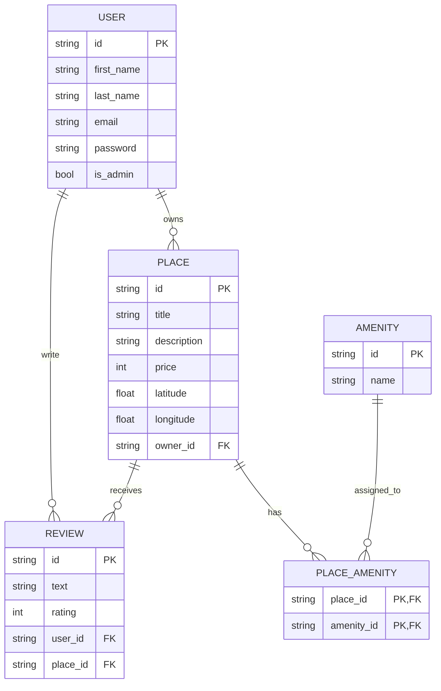

## Entity Relationship Diagram

```mermaid
erDiagram

USER ||--o{ PLACE : owns
USER ||--O{ REVIEW : write
PLACE ||--o{ REVIEW : receives
PLACE ||--o{ PLACE_AMENITY : has
AMENITY ||--o{ PLACE_AMENITY : assigned_to

USER{
    string id PK
    string first_name
    string last_name
    string email
    string password
    bool is_admin 
    }

PLACE {
    string id PK
    string title
    string description
    int price
    float latitude
    float longitude
    string owner_id FK
}
REVIEW{
    string id PK
    string text
    int rating
    string user_id FK
    string place_id FK
}
AMENITY{
    string id PK
    string name
}
PLACE_AMENITY{
    string place_id PK, FK
    string amenity_id PK, FK

}
```
