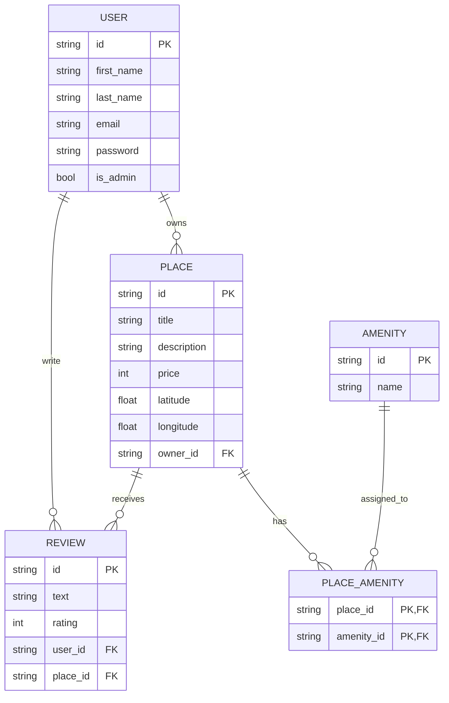

# HBnB – Authentication and Database Integration

This document describes the authentication system, role-based access control, and database implementation used in the HBnB API.

The system uses **JWT authentication**, **SQLAlchemy ORM**, and **role-based access control (RBAC)** to secure and manage the API.

---

# Table of Contents

- Technologies
- Application Configuration
- Password Hashing
- JWT Authentication
- Authenticated User Endpoints
- Administrator Access
- SQLAlchemy Repository
- User Entity Mapping
- Place, Review and Amenity Mapping
- Entity Relationships
- Database Initialization Scripts
- Database Diagrams
- Error Codes
- Testing Examples

---

# Technologies

- Python
- Flask
- Flask-RESTX
- Flask-JWT-Extended
- Flask-Bcrypt
- SQLAlchemy
- SQLite / MySQL
- Mermaid.js (for database diagrams)

---

## Application Configuration

The application factory initializes the core components required for the API.

Components initialized:

- SQLAlchemy database connection
- Bcrypt password hashing
- JWT authentication manager

### Example:

```python
db = SQLAlchemy()
bcrypt = Bcrypt()
jwt = JWTManager()

---

## Password Hashing

User passwords are securely stored using Flask-Bcrypt.

Passwords are never stored in plain text.

### Hashing Passwords

```python
user.hash_password(password)
```

### Verifying Passwords

```python
user.verify_password(password)
``` 

Passwords are never returned in API responses.

---

## JWT Authentication

The API uses JSON Web Tokens (JWT) to authenticate users.

Users must log in to obtain a token and include it in the request header.

### Login Endpoint

```python
user.verify_password(password)
```

### Example Request

```python
curl -X POST http://127.0.0.1:5000/auth/login \
-H "Content-Type: application/json" \
-d '{
"email": "user@example.com",
"password": "123456"
}'
```

### Successful Response

```python
{
"access_token": "JWT_TOKEN"
}
```

### Using the Token

```python
Authorization: Bearer JWT_TOKEN
```

---

## Authenticated User Endpoints

Authenticated User Endpoints

| Endpoint                    | Method                  | Description |
| --------------------------- | ----------------------- | ----------- |
| POST /places/               | Create a new place      |             |
| PUT /places/<place_id>      | Update a place          |             |
| POST /reviews/              | Create review           |             |
| PUT /reviews/<review_id>    | Update review           |             |
| DELETE /reviews/<review_id> | Delete review           |             |
| PUT /users/<user_id>        | Update user information |             |

Users can only modify resources they own.

Example error response:

```python
{
"message": "Unauthorized action"
}
```

Users cannot modify email and password.

---

## Administrator Access

The system implements Role-Based Access Control (RBAC).

Administrators have extended privileges.

Admin users can:

Create users

Modify any user

Modify email and password

Create amenities

Modify amenities

Bypass ownership restrictions

### Admin Endpoints

| Endpoint                    | Method          |
| --------------------------- | --------------- |
| POST /users/                | Create user     |
| PUT /users/<user_id>        | Modify any user |
| POST /amenities/            | Create amenity  |
| PUT /amenities/<amenity_id> | Modify amenity  |

```python
curl -X POST http://127.0.0.1:5000/amenities/ \
-H "Authorization: Bearer ADMIN_TOKEN" \
-H "Content-Type: application/json" \
-d '{
"name": "Swimming Pool"
}'
```

---

## SQLAlchemy Repository

The persistence layer uses the Repository Pattern.

Repositories manage database operations for each entity.

Main operations include:

create

retrieve

update

delete

### Example:

```python
class SQLAlchemyRepository(Repository):
    def add(self, obj):
        db.session.add(obj)
        db.session.commit()

```

---

## User Entity Mapping

The User model is mapped to the database using SQLAlchemy.

### Attributes include:

id

first_name

last_name

email

password

is_admin

created_at

updated_at

---

## Place, Review and Amenity Mapping

The following entities are mapped using SQLAlchemy:

### Place

Represents a property listed by a user.

### Review

Represents a user review of a place.

### Amenity

Represents features such as WiFi or parking.

### Entity Relationships

Relationships implemented in the database include:

| Relationship      | Description                       |
| ----------------- | --------------------------------- |
| User → Places     | A user can own multiple places    |
| Place → Reviews   | A place can have multiple reviews |
| User → Reviews    | A user can write reviews          |
| Place ↔ Amenities | Many-to-many relationship         |

---

## Database Initialization Scripts

SQL scripts are used to initialize database tables and seed initial data.

Example tasks include:

creating tables

inserting default amenities

preparing development data

---

## Database Diagram

The database schema is visualized using Mermaid.js ER diagrams.

## Entity Relationship Diagram



---

## Summary

The HBnB API provides:

Secure password hashing

JWT authentication

Protected endpoints

Role-based access control

SQLAlchemy ORM persistence

Structured database relationships
