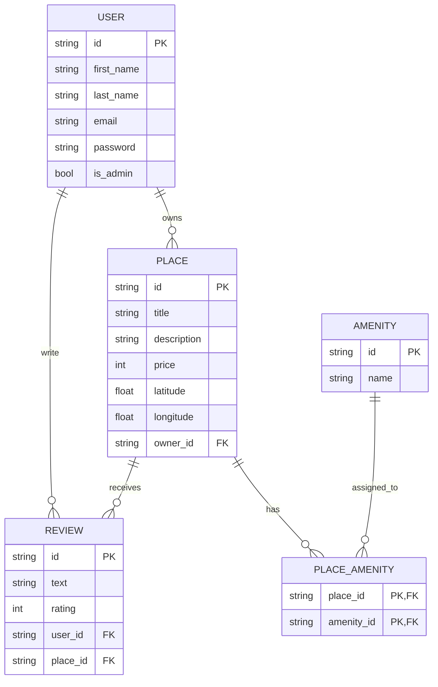

# HBnB – Authentication and Database Integration

This document describes the authentication system, role-based access control, and database implementation used in the HBnB API.

The system uses **JWT authentication**, **SQLAlchemy ORM**, and **role-based access control (RBAC)** to secure and manage the API.

---

## Table of Contents

- [Technologies](#technologies)
- [Project Structure](#project-structure)
- [Setup Instructions](#setup-instructions)
- [Application Configuration](#application-configuration)
- [API Documentation](#api-documentation)
- [Password Hashing](#password-hashing)
- [JWT Authentication](#jwt-authentication)
- [Authenticated User Endpoints](#authenticated-user-endpoints)
- [Validation Rules](#validation-rules)
- [Error Messages](#error-messages)
- [Testing Examples](#testing-examples)
- [Administrator Access (RBAC)](#administrator-access-rbac)
- [Admin-Only Endpoints](#admin-only-endpoints)
- [Admin Privileges](#admin-privileges)
- [Ownership Bypass](#ownership-bypass)
- [Admin Testing Examples](#admin-testing-examples)
- [Admin Error Responses](#admin-error-responses)
- [Security Summary](#security-summary)
- [Database Schema](#database-schema)
- [Entities](#entities)
- [Entity Relationships](#entity-relationships)
- [Database Initialization](#database-initialization)
- [Database Diagram](#database-diagram)
- [Summary](#summary)

---

## Technologies

- Python
- Flask
- Flask-RESTX
- Flask-JWT-Extended
- Flask-Bcrypt
- SQLAlchemy
- SQLite / MySQL
- Mermaid.js (for database diagrams)

---

## Project Structure

```bash
part3/
│
├── app/
│   ├── api/
│   ├── models/
│   ├── repositories/
│   ├── services/
│   └── __init__.py
│
├── instance/
│   └── development.db
│
├── sql/
│   ├── schema.sql
│   └── seed.sql
│
├── requirements.txt
└── README.md
```

---

## Setup Instructions

1. Clone the repository
```bash
git clone https://github.com/laradreamer79/holbertonschool-hbnb.git
```
2. Go to part3

```bash
cd part3
```

3. Create a virtual environment

```bash
python3 -m venv venv
source venv/bin/activate
```

4. Install dependencies

```bash
pip install -r requirements.txt
```

5. Run the application

```bash
python3 run.py
```
---
## API Documentation

The API documentation is available through Swagger UI:

http://127.0.0.1:5000/

---

## Application Configuration

The application factory initializes the core components required for the API.

Components initialized:

- SQLAlchemy database connection
- Bcrypt password hashing
- JWT authentication manager

### Example:

```python
db = SQLAlchemy()
bcrypt = Bcrypt()
jwt = JWTManager()

```
---

## Password Hashing

User passwords are securely stored using Flask-Bcrypt.

Passwords are never stored in plain text.

### Hashing Passwords

```python
user.hash_password(password)
```

### Verifying Passwords

```python
user.verify_password(password)
``` 

Passwords are never returned in API responses.

---

## JWT Authentication

The API uses JSON Web Tokens (JWT) to authenticate users.

Users must log in to obtain a token and include it in the request header.

### Login Endpoint

```python
POST /auth/login
```

### Example Request

```python
curl -X POST http://127.0.0.1:5000/auth/login \
-H "Content-Type: application/json" \
-d '{
"email": "user@example.com",
"password": "123456"
}'
```

### Successful Response

```python
{
"access_token": "JWT_TOKEN"
}
```

### Using the Token

```python
Authorization: Bearer JWT_TOKEN
```

---
## Authenticated User Endpoints

This section describes the authenticated endpoints secured with JWT authentication.  
These endpoints allow authenticated users to create and modify places and reviews, as well as update their own profile data.

### Protected Endpoints

The following endpoints require a valid JWT token:

| Endpoint | Method | Description |
|----------|--------|-------------|
| `/places/` | POST | Create a new place |
| `/places/<place_id>` | PUT | Update an existing place |
| `/reviews/` | POST | Create a new review |
| `/reviews/<review_id>` | PUT | Update an existing review |
| `/reviews/<review_id>` | DELETE | Delete a review |
| `/users/<user_id>` | PUT | Update the authenticated user’s own details |

### Public Endpoints

The following endpoints remain publicly accessible and do not require a JWT token:

| Endpoint | Method | Description |
|----------|--------|-------------|
| `/places/` | GET | Retrieve all available places |
| `/places/<place_id>` | GET | Retrieve detailed information about a specific place |

### Authentication Logic

Protected endpoints use the `@jwt_required()` decorator from `flask-jwt-extended`.

Example:

```python
from flask_jwt_extended import jwt_required, get_jwt_identity

@jwt_required()
def post(self):
    current_user_id = get_jwt_identity()
```

The authenticated user's ID is extracted from the JWT token and used to validate ownership and permissions.

---

## Validation Rules

### Create Place

When creating a place:

- The user must be authenticated
- The `owner_id` is automatically assigned from the authenticated user token
- A user cannot manually assign another owner

### Update Place

When updating a place:

- The user must be authenticated
- Only the owner of the place can modify it
- If the user is not the owner, the request is denied

### Create Review

When creating a review:

- The user must be authenticated
- The user cannot review their own place
- The user can only review the same place once

### Update Review

When updating a review:

- The user must be authenticated
- Only the creator of the review can modify it

### Delete Review

When deleting a review:

- The user must be authenticated
- Only the creator of the review can delete it

### Update User Information

When updating user information:

- The user must be authenticated
- A user can only update their own profile
- Regular users cannot modify `email` or `password` using this endpoint

---

## Error Messages

| HTTP Status Code | Message | Description |
|------------------|---------|-------------|
| `400` | `Invalid credentials` | Incorrect email or password during login |
| `400` | `You cannot review your own place.` | A user attempted to review a place they own |
| `400` | `You have already reviewed this place.` | A user attempted to submit more than one review for the same place |
| `400` | `You cannot modify email or password.` | A regular user attempted to modify restricted fields |
| `401` | `Missing Authorization Header` | No JWT token was provided in the request |
| `401` | `Token has expired` | The JWT token is no longer valid |
| `403` | `Unauthorized action` | The authenticated user attempted to modify or delete a resource they do not own |
| `404` | `User not found` | The requested user does not exist |
| `404` | `Place not found` | The requested place does not exist |
| `404` | `Review not found` | The requested review does not exist |

---

## Testing Examples

### Login

```bash
curl -X POST http://127.0.0.1:5000/auth/login \
-H "Content-Type: application/json" \
-d '{
  "email": "user@example.com",
  "password": "123456"
}'
```

### Create Place

```bash
curl -X POST http://127.0.0.1:5000/places/ \
-H "Authorization: Bearer YOUR_TOKEN" \
-H "Content-Type: application/json" \
-d '{
  "title": "New Place",
  "description": "Nice place",
  "price": 100,
  "latitude": 24.7,
  "longitude": 46.6
}'
```

### Update Place

```bash
curl -X PUT http://127.0.0.1:5000/places/PLACE_ID \
-H "Authorization: Bearer YOUR_TOKEN" \
-H "Content-Type: application/json" \
-d '{
  "title": "Updated Place"
}'
```

### Create Review

```bash
curl -X POST http://127.0.0.1:5000/reviews/ \
-H "Authorization: Bearer YOUR_TOKEN" \
-H "Content-Type: application/json" \
-d '{
  "text": "Great place!",
  "rating": 5,
  "place_id": "PLACE_ID"
}'
```

### Update Review

```bash
curl -X PUT http://127.0.0.1:5000/reviews/REVIEW_ID \
-H "Authorization: Bearer YOUR_TOKEN" \
-H "Content-Type: application/json" \
-d '{
  "text": "Updated review"
}'
```

### Delete Review

```bash
curl -X DELETE http://127.0.0.1:5000/reviews/REVIEW_ID \
-H "Authorization: Bearer YOUR_TOKEN"
```

### Update User Information

```bash
curl -X PUT http://127.0.0.1:5000/users/USER_ID \
-H "Authorization: Bearer YOUR_TOKEN" \
-H "Content-Type: application/json" \
-d '{
  "first_name": "Updated Name"
}'
```

### Public Endpoint Example

```bash
curl -X GET http://127.0.0.1:5000/places/
```

```bash
curl -X GET http://127.0.0.1:5000/places/PLACE_ID
```
---

## Administrator Access (RBAC)

This section describes administrator privileges implemented using **Role-Based Access Control (RBAC)**.

Administrators have elevated permissions that allow them to manage system resources and bypass certain ownership restrictions.

Administrator privileges are determined by the `is_admin` claim included in the JWT token.

Example:

```python
from flask_jwt_extended import get_jwt

claims = get_jwt()
is_admin = claims.get("is_admin", False)
```

If `is_admin` is `True`, the user is granted administrator privileges.

---

## Admin-Only Endpoints

The following endpoints are restricted to administrators only.

| Endpoint | Method | Description |
|----------|--------|-------------|
| `/users/` | POST | Create a new user |
| `/users/<user_id>` | PUT | Modify any user's details |
| `/amenities/` | POST | Create a new amenity |
| `/amenities/<amenity_id>` | PUT | Modify an amenity |

If a non-admin user attempts to access these endpoints, the request will be rejected.

Example error response:

```json
{
  "error": "Admin privileges required"
}
```

---

## Admin Privileges

Administrators can perform the following actions:

- Create new users
- Modify any user's information
- Modify email and password fields
- Create amenities
- Modify amenities
- Modify any place
- Modify or delete any review

This allows administrators to manage the entire platform.

---

## Ownership Bypass

Regular users can only modify resources they own.

Administrators bypass this restriction.

Example logic:

```python
claims = get_jwt()
is_admin = claims.get("is_admin", False)

if not is_admin and place.owner_id != current_user_id:
    return {"error": "Unauthorized action"}, 403
```

This means:

- **Regular users** → only modify their own resources
- **Admins** → modify any resource

---

## Admin Testing Examples

### Create User

```bash
curl -X POST http://127.0.0.1:5000/users/ \
-H "Authorization: Bearer ADMIN_TOKEN" \
-H "Content-Type: application/json" \
-d '{
  "first_name": "New",
  "last_name": "User",
  "email": "newuser@example.com",
  "password": "123456"
}'
```

### Modify User

```bash
curl -X PUT http://127.0.0.1:5000/users/USER_ID \
-H "Authorization: Bearer ADMIN_TOKEN" \
-H "Content-Type: application/json" \
-d '{
  "email": "updated_email@example.com"
}'
```

### Create Amenity

```bash
curl -X POST http://127.0.0.1:5000/amenities/ \
-H "Authorization: Bearer ADMIN_TOKEN" \
-H "Content-Type: application/json" \
-d '{
  "name": "Swimming Pool"
}'
```

### Modify Amenity

```bash
curl -X PUT http://127.0.0.1:5000/amenities/AMENITY_ID \
-H "Authorization: Bearer ADMIN_TOKEN" \
-H "Content-Type: application/json" \
-d '{
  "name": "Updated Amenity"
}'
```

---

## Admin Error Responses

| HTTP Status Code | Message | Description |
|------------------|---------|-------------|
| `403` | `Admin privileges required` | Non-admin attempted to access an admin endpoint |
| `400` | `Email already registered` | Attempted to create a user with an existing email |
| `403` | `Unauthorized action` | Non-admin attempted to modify another user's resource |

---

## Security Summary

The RBAC system ensures:

- Only administrators can manage users and amenities
- Ownership restrictions protect user data
- Administrators retain full system control
- JWT authentication secures all protected endpoints

---

## Database Schema

The HBnB API uses **SQLAlchemy ORM** to manage database persistence.

The database consists of four main entities:

- **User**
- **Place**
- **Review**
- **Amenity**

Each entity inherits common attributes from the base model:

| Field | Description |
|------|-------------|
| `id` | Unique identifier |
| `created_at` | Creation timestamp |
| `updated_at` | Last update timestamp |

---

## Entities

### User

Represents a platform user.

| Field | Type | Description |
|------|------|-------------|
| id | UUID | Unique user identifier |
| first_name | String | User's first name |
| last_name | String | User's last name |
| email | String | Unique user email |
| password | String | Hashed password |
| is_admin | Boolean | Admin privilege flag |

---

### Place

Represents a property listed by a user.

| Field | Type | Description |
|------|------|-------------|
| id | UUID | Unique place identifier |
| title | String | Place title |
| description | String | Place description |
| price | Integer | Price per night |
| latitude | Float | Location latitude |
| longitude | Float | Location longitude |
| owner_id | UUID | Reference to the user who owns the place |

---

### Review

Represents a review written by a user for a place.

| Field | Type | Description |
|------|------|-------------|
| id | UUID | Unique review identifier |
| text | String | Review content |
| rating | Integer | Rating value |
| user_id | UUID | Author of the review |
| place_id | UUID | Reviewed place |

---

### Amenity

Represents features provided by places.

Examples:

- WiFi
- Parking
- Swimming Pool

| Field | Type | Description |
|------|------|-------------|
| id | UUID | Unique amenity identifier |
| name | String | Amenity name |

---

## Entity Relationships

The following relationships exist in the system:

| Relationship | Description |
|-------------|-------------|
| User → Place | One user can own multiple places |
| Place → Review | One place can have many reviews |
| User → Review | One user can write multiple reviews |
| Place ↔ Amenity | Many-to-many relationship |

---

## Database Initialization

Create database tables using Flask shell:

```bash
flask shell
```
```bash
from app import db
db.create_all()
```

Insert initial data:

```bash
sqlite3 instance/development.db < sql/seed.sql
```

---

## Database Diagram

The database schema is visualized using Mermaid.js ER diagrams.

## Entity Relationship Diagram



---

## Summary

The HBnB API provides:

Secure password hashing

JWT authentication

Protected endpoints

Role-based access control

SQLAlchemy ORM persistence

Structured database relationships
